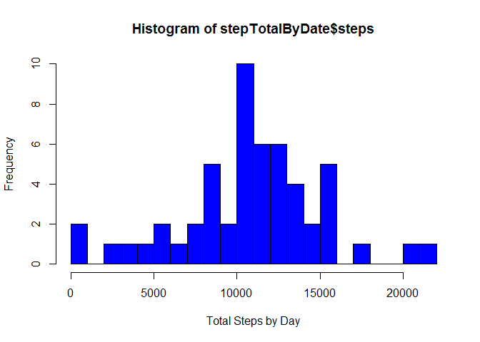
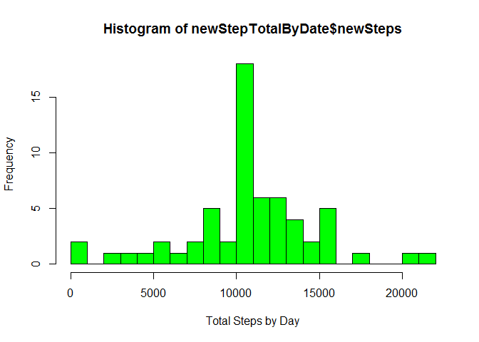
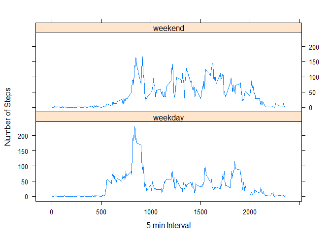

# PA1_template.Rmd
Keith Tate  
Monday, July 13, 2015  

This document is for the 1st Peer Assessment in the Coursera course "Reproducible Research".

##Assignment


###Loading and preprocessing the data

1. Download the file and load the data

```r
activity <- read.csv(".\\Activity.csv",na.strings="NA")

#process the data to the correct datatypes
activity$steps <- as.numeric(activity$steps)
activity$interval <- as.numeric(activity$interval)
```

###What is the mean total number of steps taken per day

1. Calculate the total number of steps taken per day

```r
stepTotalByDate <- aggregate(steps~date,activity,sum)
```

2. Make a histogram of the total number of steps taken each day

```r
hist(stepTotalByDate$steps,col="blue",xlab="Total Steps by Day",breaks=20)
```

 

3. Calculate the mean and median of the total number of step taken per day  
    The mean of the total steps taken is: 

```r
mean(stepTotalByDate$steps,na.rm=T)
```

```
## [1] 10766.19
```
    The median of the total steps take is:

```r
median(stepTotalByDate$steps,na.rm=T)   
```

```
## [1] 10765
```

###What is the average daily activity pattern?
1. Make a time series plot of the 5-minute interval and the average number of steps taken, averaged across all days

```r
stepByInterval <- aggregate(steps~interval,activity,mean)

plot(stepByInterval,type="l")
```

 

2. Which 5-minute interval, on average across all the days in the dataset, contains the maximum number of steps?

```r
stepByInterval$interval[which.max(stepByInterval$steps)]
```

```
## [1] 835
```

### Imputing missing values
1. Calculate and report the total number of missing values in the dataset 

```r
sum(is.na(activity$steps))
```

```
## [1] 2304
```

2. Since there were NA values in the data I have replaced them with the mean of that interval across all days. I have created a new dataset (activity.No.NA) that has these new values and the orignal non-NA values.

```r
y <- merge(activity,stepByInterval,by = "interval",all.x=T)

colnames(y) = c("interval","steps","date","avgSteps")

activity.No.NA <- y %>% 
                        group_by(interval) %>% 
                        mutate(newSteps = ifelse(is.na(steps),avgSteps,steps)) %>% 
                        select(interval,date,newSteps)
```

3. Make a histogram with the new totals

```r
newStepTotalByDate <- aggregate(newSteps~date,activity.No.NA,sum)

hist(newStepTotalByDate$newSteps,col="green",xlab="Total Steps by Day",breaks=20)
```

 

The new mean for this dataset is:

```r
mean(newStepTotalByDate$newSteps)
```

```
## [1] 10766.19
```

The new median for this dataset is:

```r
median(newStepTotalByDate$newSteps)
```

```
## [1] 10766.19
```

There is no difference in the mean and very little difference in the median.

### Are there differences in activity patterns between weekdays and weekends?
1. Create a new factor variable in the dataset with two levels - "weekday" and "weekend" indicating whether a given date is a weekday or weekend day.

```r
activity.No.NA$date <- as.POSIXct(activity.No.NA$date)

activity.No.NA$weekDay <- factor(format(activity.No.NA$date,"%A"))

levels(activity.No.NA$weekDay) <- list(weekday = c("Monday","Tuesday","Wednesday","Thursday","Friday"),
                                       weekend = c("Saturday","Sunday"))
```

2. Make a panel plot containing a time series plot (i.e. type = "l") of the 5-minute interval (x-axis) and the average number of steps taken, averaged across all weekday days or weekend days (y-axis)

```r
avgWDSteps <- aggregate(activity.No.NA$newSteps,
                        list(interval = as.numeric(activity.No.NA$interval),
                             weekDay = activity.No.NA$weekDay),
                       FUN = "mean")

colnames(avgWDSteps) =  c("interval","weekDay","AvgSteps")


xyplot(avgWDSteps$AvgSteps ~ avgWDSteps$interval | avgWDSteps$weekDay,
      layout = c(1,2), type = "l", xlab = "5 min Interval", ylab = "Number of Steps")
```

 
